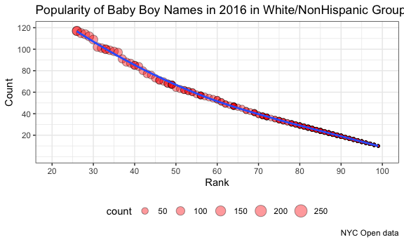

P8105\_hw2\_yc384
================
Ying Chen (UNI: yc384)
9/24/2019

setwd(“/Users/macbook/Documents/Statistics/P8105/HW/P8105
    HW2”)

``` r
library (tidyverse)
```

    ## ── Attaching packages ──────────────────────────────────────────────── tidyverse 1.2.1 ──

    ## ✔ ggplot2 3.2.1     ✔ purrr   0.3.2
    ## ✔ tibble  2.1.3     ✔ dplyr   0.8.3
    ## ✔ tidyr   1.0.0     ✔ stringr 1.4.0
    ## ✔ readr   1.3.1     ✔ forcats 0.4.0

    ## ── Conflicts ─────────────────────────────────────────────────── tidyverse_conflicts() ──
    ## ✖ dplyr::filter() masks stats::filter()
    ## ✖ dplyr::lag()    masks stats::lag()

``` r
library (dplyr)
library(readxl)
library(patchwork)

rm(list = ls())

knitr::opts_chunk$set(echo = TRUE, warning = FALSE,
  fig.width = 6,
  fig.asp = .6,
  out.width = "90%"
)

theme_set(theme_bw() + theme(legend.position = "bottom"))
options(tibble.print_min = 3)
```

## P8105 DSI Homework 2

#### This assignment reinforces ideas in Data Wrangling I

### 0\. Problem 0

  - Github repo:
    <https://github.com/YingCarolineChen/p8105_hw2_yc384.git>
  - RMarkdown file name: P8105\_hw2\_yc384
  - Create a subdirectory to store local data files and the path is:
    “~/Documents/Statistics/P8105/HW/P8105 HW2”

### 1\. Problem 1

#### Part 1-1: Read and tidy Mr. Trash Wheel data

  - Dataset: used **updated data
    “Trash-Wheel-Collection-Totals-8-6-19.xlsx”**
  - Original dataset contains 7 sheets. For this problem, we only read
    and tidy the Mr. Trash Wheel sheet and sheets with precipitation
    data for 2017 and 2018.

<!-- end list -->

``` r
# read in Mr. Trash Wheel sheet
# skip first rows with notes / figures
# drop last column that containing notes

MrTrashWheel = 
  read_excel("./data/Trash-Wheel-Collection-Totals-8-6-19.xlsx", sheet = "Mr. Trash Wheel", skip = 1, range = "A2:N338", col_names = TRUE) %>% 
  janitor::clean_names()

# omit rows has NA for dumpster
dumpster = 
  drop_na(MrTrashWheel,dumpster) %>% 
  # Round sports balls to nearest integer
  mutate(
  sports_balls_round = round(sports_balls, digits = 0),
  sports_balls_int = as.integer(sports_balls_round)
)

# rename to reasonable variable names
dumpster_rename = rename(dumpster, bags_grocery = grocery_bags, bags_chip  = chip_bags, bottles_plastic = plastic_bottles, bottles_glass = glass_bottles)

# Look at data
head(MrTrashWheel,5)
```

    ## # A tibble: 5 x 14
    ##   dumpster month  year date                weight_tons volume_cubic_ya…
    ##      <dbl> <chr> <dbl> <dttm>                    <dbl>            <dbl>
    ## 1        1 May    2014 2014-05-16 00:00:00        4.31               18
    ## 2        2 May    2014 2014-05-16 00:00:00        2.74               13
    ## 3        3 May    2014 2014-05-16 00:00:00        3.45               15
    ## 4        4 May    2014 2014-05-17 00:00:00        3.1                15
    ## 5        5 May    2014 2014-05-17 00:00:00        4.06               18
    ## # … with 8 more variables: plastic_bottles <dbl>, polystyrene <dbl>,
    ## #   cigarette_butts <dbl>, glass_bottles <dbl>, grocery_bags <dbl>,
    ## #   chip_bags <dbl>, sports_balls <dbl>, homes_powered <dbl>

``` r
head(dumpster_rename, 5)
```

    ## # A tibble: 5 x 16
    ##   dumpster month  year date                weight_tons volume_cubic_ya…
    ##      <dbl> <chr> <dbl> <dttm>                    <dbl>            <dbl>
    ## 1        1 May    2014 2014-05-16 00:00:00        4.31               18
    ## 2        2 May    2014 2014-05-16 00:00:00        2.74               13
    ## 3        3 May    2014 2014-05-16 00:00:00        3.45               15
    ## 4        4 May    2014 2014-05-17 00:00:00        3.1                15
    ## 5        5 May    2014 2014-05-17 00:00:00        4.06               18
    ## # … with 10 more variables: bottles_plastic <dbl>, polystyrene <dbl>,
    ## #   cigarette_butts <dbl>, bottles_glass <dbl>, bags_grocery <dbl>,
    ## #   bags_chip <dbl>, sports_balls <dbl>, homes_powered <dbl>,
    ## #   sports_balls_round <dbl>, sports_balls_int <int>

``` r
summary(MrTrashWheel)
```

    ##     dumpster         month                year     
    ##  Min.   :  1.00   Length:336         Min.   :2014  
    ##  1st Qu.: 72.25   Class :character   1st Qu.:2015  
    ##  Median :143.50   Mode  :character   Median :2016  
    ##  Mean   :143.50                      Mean   :2016  
    ##  3rd Qu.:214.75                      3rd Qu.:2017  
    ##  Max.   :286.00                      Max.   :2018  
    ##  NA's   :50                          NA's   :50    
    ##       date                      weight_tons     volume_cubic_yards
    ##  Min.   :2014-05-16 00:00:00   Min.   : 0.960   Min.   :  7.00    
    ##  1st Qu.:2015-06-10 00:00:00   1st Qu.: 2.868   1st Qu.: 15.00    
    ##  Median :2016-07-18 00:00:00   Median : 3.445   Median : 15.00    
    ##  Mean   :2016-07-22 23:04:36   Mean   : 5.575   Mean   : 26.47    
    ##  3rd Qu.:2017-08-19 00:00:00   3rd Qu.: 4.160   3rd Qu.: 18.00    
    ##  Max.   :2018-08-09 00:00:00   Max.   :76.890   Max.   :336.00    
    ##  NA's   :50                                                       
    ##  plastic_bottles  polystyrene    cigarette_butts  glass_bottles   
    ##  Min.   :  210   Min.   :  320   Min.   :  1000   Min.   :  2.00  
    ##  1st Qu.: 1205   1st Qu.: 1450   1st Qu.: 14000   1st Qu.: 15.00  
    ##  Median : 2242   Median : 2565   Median : 31000   Median : 31.50  
    ##  Mean   : 3346   Mean   : 3940   Mean   : 61280   Mean   : 47.49  
    ##  3rd Qu.: 3205   3rd Qu.: 3740   3rd Qu.: 65000   3rd Qu.: 48.00  
    ##  Max.   :35290   Max.   :45740   Max.   :999000   Max.   :639.00  
    ##                                                                   
    ##   grocery_bags     chip_bags      sports_balls   homes_powered    
    ##  Min.   :   50   Min.   :  330   Min.   :  0.0   Min.   :   0.00  
    ##  1st Qu.:  743   1st Qu.: 1168   1st Qu.:  6.0   1st Qu.:  32.38  
    ##  Median : 1515   Median : 2140   Median : 11.5   Median :  52.83  
    ##  Mean   : 2410   Mean   : 3263   Mean   : 21.5   Mean   :  71.30  
    ##  3rd Qu.: 2575   3rd Qu.: 3125   3rd Qu.: 24.0   3rd Qu.:  64.71  
    ##  Max.   :32640   Max.   :39240   Max.   :420.0   Max.   :1055.67  
    ## 

``` r
summary(dumpster_rename)
```

    ##     dumpster         month                year     
    ##  Min.   :  1.00   Length:286         Min.   :2014  
    ##  1st Qu.: 72.25   Class :character   1st Qu.:2015  
    ##  Median :143.50   Mode  :character   Median :2016  
    ##  Mean   :143.50                      Mean   :2016  
    ##  3rd Qu.:214.75                      3rd Qu.:2017  
    ##  Max.   :286.00                      Max.   :2018  
    ##       date                      weight_tons    volume_cubic_yards
    ##  Min.   :2014-05-16 00:00:00   Min.   :0.960   Min.   : 7.00     
    ##  1st Qu.:2015-06-10 00:00:00   1st Qu.:2.732   1st Qu.:15.00     
    ##  Median :2016-07-18 00:00:00   Median :3.325   Median :15.00     
    ##  Mean   :2016-07-22 23:04:36   Mean   :3.281   Mean   :15.57     
    ##  3rd Qu.:2017-08-19 00:00:00   3rd Qu.:3.830   3rd Qu.:17.00     
    ##  Max.   :2018-08-09 00:00:00   Max.   :5.620   Max.   :20.00     
    ##  bottles_plastic  polystyrene   cigarette_butts  bottles_glass   
    ##  Min.   : 210    Min.   : 320   Min.   :  1000   Min.   :  2.00  
    ##  1st Qu.: 980    1st Qu.:1235   1st Qu.: 12000   1st Qu.: 12.00  
    ##  Median :1925    Median :2250   Median : 25500   Median : 26.00  
    ##  Mean   :1968    Mean   :2316   Mean   : 36016   Mean   : 27.91  
    ##  3rd Qu.:2668    3rd Qu.:3150   3rd Qu.: 46000   3rd Qu.: 41.75  
    ##  Max.   :5960    Max.   :6540   Max.   :310000   Max.   :110.00  
    ##   bags_grocery    bags_chip     sports_balls   homes_powered  
    ##  Min.   :  50   Min.   : 330   Min.   : 0.00   Min.   : 0.00  
    ##  1st Qu.: 650   1st Qu.:1040   1st Qu.: 5.20   1st Qu.:30.54  
    ##  Median :1240   Median :1840   Median : 8.00   Median :50.92  
    ##  Mean   :1417   Mean   :1920   Mean   :12.64   Mean   :41.98  
    ##  3rd Qu.:2130   3rd Qu.:2655   3rd Qu.:18.00   3rd Qu.:60.25  
    ##  Max.   :3750   Max.   :5085   Max.   :56.00   Max.   :93.67  
    ##  sports_balls_round sports_balls_int
    ##  Min.   : 0.00      Min.   : 0.00   
    ##  1st Qu.: 5.00      1st Qu.: 5.00   
    ##  Median : 8.00      Median : 8.00   
    ##  Mean   :12.63      Mean   :12.63   
    ##  3rd Qu.:18.00      3rd Qu.:18.00   
    ##  Max.   :56.00      Max.   :56.00

### 1\. Problem 1 Part 1-2

#### \* Read and tidy precipitation data

#### \* join datasets and some data manipulations

``` r
# read in precipitation data for 2017 and 2018
# Omit rows without precipitation data and add a variable year

precipitation_2017 = 
  read_excel("./data/HealthyHarborWaterWheelTotals2018-7-28.xlsx", sheet = "2017 Precipitation", skip = 1, range = "A2:B14", col_names = TRUE) %>%
  janitor::clean_names() %>% 
  mutate(
    year = 2017) %>% 
  drop_na (total)

precipitation_2018 = 
  read_excel("./data/HealthyHarborWaterWheelTotals2018-7-28.xlsx", sheet = "2018 Precipitation", skip = 1, range = "A2:B14", col_names = TRUE) %>%
  janitor::clean_names() %>% 
  mutate(
    year = 2018) %>% 
  drop_na (total)

# Combine precipitation datasets
precipitation_join = 
  full_join(precipitation_2017, precipitation_2018, by = NULL) %>% 
  # convert month to a character variable
  mutate(
    month = month.name[month]
  )
```

    ## Joining, by = c("month", "total", "year")

``` r
head(precipitation_join,5)
```

    ## # A tibble: 5 x 3
    ##   month    total  year
    ##   <chr>    <dbl> <dbl>
    ## 1 January   2.34  2017
    ## 2 February  1.46  2017
    ## 3 March     3.57  2017
    ## 4 April     3.99  2017
    ## 5 May       5.64  2017

``` r
summary(precipitation_2017)
```

    ##      month           total            year     
    ##  Min.   : 1.00   Min.   :0.000   Min.   :2017  
    ##  1st Qu.: 3.75   1st Qu.:1.285   1st Qu.:2017  
    ##  Median : 6.50   Median :2.145   Median :2017  
    ##  Mean   : 6.50   Mean   :2.744   Mean   :2017  
    ##  3rd Qu.: 9.25   3rd Qu.:4.103   3rd Qu.:2017  
    ##  Max.   :12.00   Max.   :7.090   Max.   :2017

``` r
summary(precipitation_2018)
```

    ##      month         total            year     
    ##  Min.   :1.0   Min.   :0.200   Min.   :2018  
    ##  1st Qu.:2.5   1st Qu.:1.570   1st Qu.:2018  
    ##  Median :4.0   Median :2.390   Median :2018  
    ##  Mean   :4.0   Mean   :3.357   Mean   :2018  
    ##  3rd Qu.:5.5   3rd Qu.:4.250   3rd Qu.:2018  
    ##  Max.   :7.0   Max.   :9.270   Max.   :2018

``` r
summary(precipitation_join)
```

    ##     month               total            year     
    ##  Length:19          Min.   :0.000   Min.   :2017  
    ##  Class :character   1st Qu.:1.180   1st Qu.:2017  
    ##  Mode  :character   Median :2.340   Median :2017  
    ##                     Mean   :2.970   Mean   :2017  
    ##                     3rd Qu.:4.215   3rd Qu.:2018  
    ##                     Max.   :9.270   Max.   :2018

### 2\. Problem 1 Part 1-3

#### \*Datasets description using inline R code

``` r
# sub dataset of year 2017
dump2017 = filter(dumpster, year == 2017)
```

Dataset Mr. Trash Wheel contains 336 obersvations and 14 variables. The
key variable for this dataset is called “dumpster”. Variable “dumpster”
has 50 rows with “NA” and will be excluded for future analyses. The
median number of sports balls in a dumpster in 2017 is: 8.

Dataset precipitation\_2017 contains 12 obersvations and 3 variables.
The key variables for this dataset is year and month. Dataset
precipitation\_2018 contains 7 obersvations and 3 variables. The key
variables for this dataset are year and month. Dataset
precipitation\_join is the combination of datasets precipitation\_2017
and precipitation\_2018. The total precipitation is 2018 is 23.5in.

### 2\. Problem 2

  - Read pols-month.csv, unemployment.csv, and snp.csv and merge them
    using year and month as keys

#### 2\_1 Read and Tidy dataset: Pols

  - This code cunk will read and tidy pols-month.csv.
  - break up the variable mon into integer variables year, month, and
    day;
  - replace month number with month name;
  - create a president variable taking values gop and dem, remove
    prez\_dem, prez\_gop & the day variable.

<!-- end list -->

``` r
# read in pols-month.csv
pols = 
  read_csv("./data/pols-month.csv", col_names = TRUE)%>% 
  janitor::clean_names() 
```

    ## Parsed with column specification:
    ## cols(
    ##   mon = col_date(format = ""),
    ##   prez_gop = col_double(),
    ##   gov_gop = col_double(),
    ##   sen_gop = col_double(),
    ##   rep_gop = col_double(),
    ##   prez_dem = col_double(),
    ##   gov_dem = col_double(),
    ##   sen_dem = col_double(),
    ##   rep_dem = col_double()
    ## )

``` r
# tidy dataset pols
pols_tidy = 
  mutate (pols,
    # change date format
    date = as.Date(mon, format='%m/%d/%Y')
  ) %>% 
  # break date to three vars
  separate(., "date", c("year", "month", "day")) %>% 
  mutate(
  month = as.numeric(month),
  #replace month number with month name
  month = month.name[c(month)],
  year = as.integer(year)
  ) %>% 
  # create a president var taking values from prez_gop and prez_gop
  mutate(., president = ifelse (prez_gop == 1, "gop", "dem")) %>%  
  # reorder varaibles and remove three variables
  select(year, month, everything(), -prez_dem, -prez_gop, -day)

head(pols_tidy, 5)
```

    ## # A tibble: 5 x 10
    ##    year month mon        gov_gop sen_gop rep_gop gov_dem sen_dem rep_dem
    ##   <int> <chr> <date>       <dbl>   <dbl>   <dbl>   <dbl>   <dbl>   <dbl>
    ## 1  1947 Janu… 1947-01-15      23      51     253      23      45     198
    ## 2  1947 Febr… 1947-02-15      23      51     253      23      45     198
    ## 3  1947 March 1947-03-15      23      51     253      23      45     198
    ## 4  1947 April 1947-04-15      23      51     253      23      45     198
    ## 5  1947 May   1947-05-15      23      51     253      23      45     198
    ## # … with 1 more variable: president <chr>

``` r
summary(pols_tidy)
```

    ##       year         month                mon                gov_gop     
    ##  Min.   :1947   Length:822         Min.   :1947-01-15   Min.   :12.00  
    ##  1st Qu.:1964   Class :character   1st Qu.:1964-02-22   1st Qu.:18.00  
    ##  Median :1981   Mode  :character   Median :1981-03-30   Median :22.00  
    ##  Mean   :1981                      Mean   :1981-03-31   Mean   :22.48  
    ##  3rd Qu.:1998                      3rd Qu.:1998-05-07   3rd Qu.:28.00  
    ##  Max.   :2015                      Max.   :2015-06-15   Max.   :34.00  
    ##     sen_gop        rep_gop         gov_dem        sen_dem     
    ##  Min.   :32.0   Min.   :141.0   Min.   :17.0   Min.   :44.00  
    ##  1st Qu.:42.0   1st Qu.:176.0   1st Qu.:22.0   1st Qu.:48.00  
    ##  Median :46.0   Median :195.0   Median :28.0   Median :53.00  
    ##  Mean   :46.1   Mean   :194.9   Mean   :27.2   Mean   :54.41  
    ##  3rd Qu.:51.0   3rd Qu.:222.0   3rd Qu.:32.0   3rd Qu.:58.00  
    ##  Max.   :56.0   Max.   :253.0   Max.   :41.0   Max.   :71.00  
    ##     rep_dem     president        
    ##  Min.   :188   Length:822        
    ##  1st Qu.:211   Class :character  
    ##  Median :250   Mode  :character  
    ##  Mean   :245                     
    ##  3rd Qu.:268                     
    ##  Max.   :301

#### 2\_2 2\_1 Read and Tidy dataset: snp

``` r
# read and tidy in snp.csv
snp_tidy = 
  read_csv("./data/snp.csv", col_names = TRUE) %>% 
  mutate (
    # change date format
    Date1 = as.Date(date, format='%m/%d/%Y')
  ) %>% 
  janitor::clean_names() %>% 
  # break date to three vars
  separate(., "date1", c("year", "month", "day")) %>% 
  mutate (
   month = as.numeric(month),
   #replace month number with month name
   month = month.name[c(month)],
   year = as.integer(year)
  ) %>% 
  # reorder varaibles and remove three variables
  select(year, month, everything(), -day)
```

    ## Parsed with column specification:
    ## cols(
    ##   date = col_character(),
    ##   close = col_double()
    ## )

``` r
# arrange snp_tidy by year and month
snp_tidy = arrange(snp_tidy, year, month)

head(snp_tidy, 5)
```

    ## # A tibble: 5 x 4
    ##    year month    date      close
    ##   <int> <chr>    <chr>     <dbl>
    ## 1  1950 April    4/3/1950   18.0
    ## 2  1950 August   8/1/1950   18.4
    ## 3  1950 December 12/1/1950  20.4
    ## 4  1950 February 2/1/1950   17.2
    ## 5  1950 January  1/3/1950   17.0

``` r
summary(snp_tidy)
```

    ##       year         month               date               close        
    ##  Min.   :1950   Length:787         Length:787         Min.   :  17.05  
    ##  1st Qu.:1966   Class :character   Class :character   1st Qu.:  83.73  
    ##  Median :1982   Mode  :character   Mode  :character   Median : 138.53  
    ##  Mean   :1982                                         Mean   : 474.89  
    ##  3rd Qu.:1999                                         3rd Qu.: 941.79  
    ##  Max.   :2015                                         Max.   :2107.39

#### 2\_3 2\_1 Read and Tidy dataset: unemployment

``` r
# read in unemployment.csv
unemployment = 
  read_csv("./data/unemployment.csv", col_names = TRUE) %>% 
  janitor::clean_names()
```

    ## Parsed with column specification:
    ## cols(
    ##   Year = col_double(),
    ##   Jan = col_double(),
    ##   Feb = col_double(),
    ##   Mar = col_double(),
    ##   Apr = col_double(),
    ##   May = col_double(),
    ##   Jun = col_double(),
    ##   Jul = col_double(),
    ##   Aug = col_double(),
    ##   Sep = col_double(),
    ##   Oct = col_double(),
    ##   Nov = col_double(),
    ##   Dec = col_double()
    ## )

``` r
# tidy dataset employment 
unemployment_tidy = 
  pivot_longer(
    unemployment,
    jan:dec,
    names_to = "month",
    values_to = "unemploy_rate"
  ) %>% 
  mutate(
   year = as.integer(year) 
  ) %>% 
  select(year, month, everything())

head(unemployment_tidy, 5)
```

    ## # A tibble: 5 x 3
    ##    year month unemploy_rate
    ##   <int> <chr>         <dbl>
    ## 1  1948 jan             3.4
    ## 2  1948 feb             3.8
    ## 3  1948 mar             4  
    ## 4  1948 apr             3.9
    ## 5  1948 may             3.5

``` r
summary(unemployment_tidy)
```

    ##       year         month           unemploy_rate  
    ##  Min.   :1948   Length:816         Min.   : 2.50  
    ##  1st Qu.:1965   Class :character   1st Qu.: 4.70  
    ##  Median :1982   Mode  :character   Median : 5.60  
    ##  Mean   :1982                      Mean   : 5.83  
    ##  3rd Qu.:1998                      3rd Qu.: 6.90  
    ##  Max.   :2015                      Max.   :10.80  
    ##                                    NA's   :6

#### 2\_4 Join datasets snp, pols and unemployment

``` r
# joining snp_tidy to pols_tidy by year and month
pols_snp = 
  left_join(pols_tidy, snp_tidy, by = c('year' = 'year', 'month' = 'month')) %>% 
  select(year, month, close, president,everything())

# check joined dataset
head(pols_snp,5)
```

    ## # A tibble: 5 x 12
    ##    year month close president mon        gov_gop sen_gop rep_gop gov_dem
    ##   <int> <chr> <dbl> <chr>     <date>       <dbl>   <dbl>   <dbl>   <dbl>
    ## 1  1947 Janu…    NA dem       1947-01-15      23      51     253      23
    ## 2  1947 Febr…    NA dem       1947-02-15      23      51     253      23
    ## 3  1947 March    NA dem       1947-03-15      23      51     253      23
    ## 4  1947 April    NA dem       1947-04-15      23      51     253      23
    ## 5  1947 May      NA dem       1947-05-15      23      51     253      23
    ## # … with 3 more variables: sen_dem <dbl>, rep_dem <dbl>, date <chr>

``` r
tail(pols_snp,5)
```

    ## # A tibble: 5 x 12
    ##    year month close president mon        gov_gop sen_gop rep_gop gov_dem
    ##   <int> <chr> <dbl> <chr>     <date>       <dbl>   <dbl>   <dbl>   <dbl>
    ## 1  2015 Febr… 2104. dem       2015-02-15      31      54     245      18
    ## 2  2015 March 2068. dem       2015-03-15      31      54     245      18
    ## 3  2015 April 2086. dem       2015-04-15      31      54     244      18
    ## 4  2015 May   2107. dem       2015-05-15      31      54     245      18
    ## 5  2015 June  2063. dem       2015-06-15      31      54     246      18
    ## # … with 3 more variables: sen_dem <dbl>, rep_dem <dbl>, date <chr>

``` r
# joining unemployment_tidy to pols_snp by year and month
pols_snp_unemploy = 
  left_join(pols_snp, unemployment_tidy, by = c('year' = 'year', 'month' = 'month')) %>%
  select(year, month, unemploy_rate, close, president, everything())

# check joined dataset
head(pols_snp_unemploy,5)
```

    ## # A tibble: 5 x 13
    ##    year month unemploy_rate close president mon        gov_gop sen_gop
    ##   <int> <chr>         <dbl> <dbl> <chr>     <date>       <dbl>   <dbl>
    ## 1  1947 Janu…            NA    NA dem       1947-01-15      23      51
    ## 2  1947 Febr…            NA    NA dem       1947-02-15      23      51
    ## 3  1947 March            NA    NA dem       1947-03-15      23      51
    ## 4  1947 April            NA    NA dem       1947-04-15      23      51
    ## 5  1947 May              NA    NA dem       1947-05-15      23      51
    ## # … with 5 more variables: rep_gop <dbl>, gov_dem <dbl>, sen_dem <dbl>,
    ## #   rep_dem <dbl>, date <chr>

``` r
tail(pols_snp_unemploy,5)
```

    ## # A tibble: 5 x 13
    ##    year month unemploy_rate close president mon        gov_gop sen_gop
    ##   <int> <chr>         <dbl> <dbl> <chr>     <date>       <dbl>   <dbl>
    ## 1  2015 Febr…            NA 2104. dem       2015-02-15      31      54
    ## 2  2015 March            NA 2068. dem       2015-03-15      31      54
    ## 3  2015 April            NA 2086. dem       2015-04-15      31      54
    ## 4  2015 May              NA 2107. dem       2015-05-15      31      54
    ## 5  2015 June             NA 2063. dem       2015-06-15      31      54
    ## # … with 5 more variables: rep_gop <dbl>, gov_dem <dbl>, sen_dem <dbl>,
    ## #   rep_dem <dbl>, date <chr>

``` r
summary(pols_snp_unemploy)
```

    ##       year         month           unemploy_rate     close        
    ##  Min.   :1947   Length:822         Min.   : NA   Min.   :  17.05  
    ##  1st Qu.:1964   Class :character   1st Qu.: NA   1st Qu.:  83.67  
    ##  Median :1981   Mode  :character   Median : NA   Median : 137.26  
    ##  Mean   :1981                      Mean   :NaN   Mean   : 472.85  
    ##  3rd Qu.:1998                      3rd Qu.: NA   3rd Qu.: 932.06  
    ##  Max.   :2015                      Max.   : NA   Max.   :2107.39  
    ##                                    NA's   :822   NA's   :36       
    ##   president              mon                gov_gop         sen_gop    
    ##  Length:822         Min.   :1947-01-15   Min.   :12.00   Min.   :32.0  
    ##  Class :character   1st Qu.:1964-02-22   1st Qu.:18.00   1st Qu.:42.0  
    ##  Mode  :character   Median :1981-03-30   Median :22.00   Median :46.0  
    ##                     Mean   :1981-03-31   Mean   :22.48   Mean   :46.1  
    ##                     3rd Qu.:1998-05-07   3rd Qu.:28.00   3rd Qu.:51.0  
    ##                     Max.   :2015-06-15   Max.   :34.00   Max.   :56.0  
    ##                                                                        
    ##     rep_gop         gov_dem        sen_dem         rep_dem   
    ##  Min.   :141.0   Min.   :17.0   Min.   :44.00   Min.   :188  
    ##  1st Qu.:176.0   1st Qu.:22.0   1st Qu.:48.00   1st Qu.:211  
    ##  Median :195.0   Median :28.0   Median :53.00   Median :250  
    ##  Mean   :194.9   Mean   :27.2   Mean   :54.41   Mean   :245  
    ##  3rd Qu.:222.0   3rd Qu.:32.0   3rd Qu.:58.00   3rd Qu.:268  
    ##  Max.   :253.0   Max.   :41.0   Max.   :71.00   Max.   :301  
    ##                                                              
    ##      date          
    ##  Length:822        
    ##  Class :character  
    ##  Mode  :character  
    ##                    
    ##                    
    ##                    
    ## 

We used datasets from the FiveThirtyEight data for this problem. Each of
these datasets ‘pols-month.csv’, ‘unemployment.csv’ and ‘snp.csv’ files
was imported successfully and was cleaned.

Pols\_tidy contains 822 obersvations and 10 variables. snp\_tidy
contains 787 obersvations and 4 variables. unemployment\_tidy contains
816 obersvations and 3 variables.

The three datasets were joined together by using the key variables
“year’ and”month“. The combined dataset is
called:”pols\_snp\_unemploy", which as 822 obersvations and 13
variables. The range of years is from `min(pols_snp_unemploy$year)` to
2015.

Additionl summary of this the mean umeployment rate and close points by
each year are listed below.

``` r
pols_snp_unemploy %>%
  group_by(year) %>%
  summarize(
    mean_unemploy = mean(unemploy_rate),
    sd_unemploy = sd(unemploy_rate),
    mean_close = mean(close),
    sd_close = sd(close)
    ) %>% 
knitr::kable(digits = 2)
```

| year | mean\_unemploy | sd\_unemploy | mean\_close | sd\_close |
| ---: | -------------: | -----------: | ----------: | --------: |
| 1947 |             NA |           NA |          NA |        NA |
| 1948 |             NA |           NA |          NA |        NA |
| 1949 |             NA |           NA |          NA |        NA |
| 1950 |             NA |           NA |       18.43 |      1.10 |
| 1951 |             NA |           NA |       22.36 |      0.88 |
| 1952 |             NA |           NA |       24.64 |      0.96 |
| 1953 |             NA |           NA |       24.70 |      0.89 |
| 1954 |             NA |           NA |       30.06 |      3.11 |
| 1955 |             NA |           NA |       40.88 |      3.51 |
| 1956 |             NA |           NA |       46.48 |      1.69 |
| 1957 |             NA |           NA |       44.25 |      2.62 |
| 1958 |             NA |           NA |       46.79 |      4.67 |
| 1959 |             NA |           NA |       57.81 |      1.76 |
| 1960 |             NA |           NA |       55.60 |      1.38 |
| 1961 |             NA |           NA |       66.65 |      2.93 |
| 1962 |             NA |           NA |       61.96 |      5.41 |
| 1963 |             NA |           NA |       70.22 |      3.32 |
| 1964 |             NA |           NA |       81.55 |      2.79 |
| 1965 |             NA |           NA |       88.47 |      2.73 |
| 1966 |             NA |           NA |       84.46 |      5.68 |
| 1967 |             NA |           NA |       92.18 |      3.46 |
| 1968 |             NA |           NA |       98.54 |      5.74 |
| 1969 |             NA |           NA |       97.58 |      4.46 |
| 1970 |             NA |           NA |       83.45 |      5.78 |
| 1971 |             NA |           NA |       98.21 |      3.07 |
| 1972 |             NA |           NA |      109.78 |      4.15 |
| 1973 |             NA |           NA |      106.51 |      5.69 |
| 1974 |             NA |           NA |       81.48 |     11.69 |
| 1975 |             NA |           NA |       87.13 |      4.98 |
| 1976 |             NA |           NA |      102.79 |      2.18 |
| 1977 |             NA |           NA |       97.48 |      2.72 |
| 1978 |             NA |           NA |       95.46 |      5.21 |
| 1979 |             NA |           NA |      103.33 |      4.14 |
| 1980 |             NA |           NA |      119.58 |     11.50 |
| 1981 |             NA |           NA |      127.84 |      5.85 |
| 1982 |             NA |           NA |      120.28 |     11.37 |
| 1983 |             NA |           NA |      160.72 |      7.55 |
| 1984 |             NA |           NA |      160.31 |      6.23 |
| 1985 |             NA |           NA |      188.97 |      9.69 |
| 1986 |             NA |           NA |      238.92 |     11.71 |
| 1987 |             NA |           NA |      285.99 |     31.01 |
| 1988 |             NA |           NA |      268.05 |      7.58 |
| 1989 |             NA |           NA |      326.31 |     24.25 |
| 1990 |             NA |           NA |      332.68 |     18.65 |
| 1991 |             NA |           NA |      381.53 |     18.02 |
| 1992 |             NA |           NA |      417.12 |      9.38 |
| 1993 |             NA |           NA |      453.45 |     10.09 |
| 1994 |             NA |           NA |      460.66 |     11.68 |
| 1995 |             NA |           NA |      546.88 |     46.70 |
| 1996 |             NA |           NA |      674.85 |     40.39 |
| 1997 |             NA |           NA |      875.86 |     76.49 |
| 1998 |             NA |           NA |     1087.86 |     76.83 |
| 1999 |             NA |           NA |     1330.58 |     61.61 |
| 2000 |             NA |           NA |     1419.73 |     62.48 |
| 2001 |             NA |           NA |     1185.75 |     90.61 |
| 2002 |             NA |           NA |      988.59 |    112.64 |
| 2003 |             NA |           NA |      967.93 |     87.54 |
| 2004 |             NA |           NA |     1133.96 |     31.77 |
| 2005 |             NA |           NA |     1207.77 |     29.02 |
| 2006 |             NA |           NA |     1318.31 |     52.84 |
| 2007 |             NA |           NA |     1478.10 |     44.16 |
| 2008 |             NA |           NA |     1215.22 |    187.94 |
| 2009 |             NA |           NA |      948.52 |    122.96 |
| 2010 |             NA |           NA |     1130.68 |     66.87 |
| 2011 |             NA |           NA |     1280.76 |     64.33 |
| 2012 |             NA |           NA |     1386.51 |     42.03 |
| 2013 |             NA |           NA |     1652.29 |    108.89 |
| 2014 |             NA |           NA |     1944.41 |     85.85 |
| 2015 |             NA |           NA |     2070.56 |     41.24 |

The names of the key variables of the joined dataset are **year and
month**.

### Problem 3 - Part A

#### This problem uses data from NYC Open data on the popularity of baby names.

#### The following code chunck load and tidy the data for popular baby names. We noticed that the structure of string variables child\_first\_name changed over time, we changed all the names to lower case. We also noticed that there some some duplicated rows and we used distinct function to remove all the duplicates and save to a new data file.

#### First, we load and check the data.

``` r
baby_names = 
  read_csv("./data/Popular_Baby_Names.csv", skip = 1, col_names = TRUE) %>% 
  janitor::clean_names() %>% 
  rename(
    first_name = childs_first_name,
    birth_year = year_of_birth
    ) %>% 
  # change all values of first_name to lower case
  mutate(first_name = str_to_upper(first_name)) 
```

    ## Parsed with column specification:
    ## cols(
    ##   `Year of Birth` = col_double(),
    ##   Gender = col_character(),
    ##   Ethnicity = col_character(),
    ##   `Child's First Name` = col_character(),
    ##   Count = col_double(),
    ##   Rank = col_double()
    ## )

``` r
head(baby_names,5)
```

    ## # A tibble: 5 x 6
    ##   birth_year gender ethnicity                  first_name count  rank
    ##        <dbl> <chr>  <chr>                      <chr>      <dbl> <dbl>
    ## 1       2016 FEMALE ASIAN AND PACIFIC ISLANDER OLIVIA       172     1
    ## 2       2016 FEMALE ASIAN AND PACIFIC ISLANDER CHLOE        112     2
    ## 3       2016 FEMALE ASIAN AND PACIFIC ISLANDER SOPHIA       104     3
    ## 4       2016 FEMALE ASIAN AND PACIFIC ISLANDER EMILY         99     4
    ## 5       2016 FEMALE ASIAN AND PACIFIC ISLANDER EMMA          99     4

``` r
tail(baby_names,5)
```

    ## # A tibble: 5 x 6
    ##   birth_year gender ethnicity          first_name count  rank
    ##        <dbl> <chr>  <chr>              <chr>      <dbl> <dbl>
    ## 1       2011 MALE   WHITE NON HISPANIC STEPHEN       10    97
    ## 2       2011 MALE   WHITE NON HISPANIC STEPHEN       10    97
    ## 3       2011 MALE   WHITE NON HISPANIC DEREK         10    97
    ## 4       2011 MALE   WHITE NON HISPANIC BENNETT       10    97
    ## 5       2011 MALE   WHITE NON HISPANIC ELLIS         10    97

``` r
summary(baby_names)
```

    ##    birth_year      gender           ethnicity          first_name       
    ##  Min.   :2011   Length:19418       Length:19418       Length:19418      
    ##  1st Qu.:2012   Class :character   Class :character   Class :character  
    ##  Median :2013   Mode  :character   Mode  :character   Mode  :character  
    ##  Mean   :2013                                                           
    ##  3rd Qu.:2014                                                           
    ##  Max.   :2016                                                           
    ##      count             rank      
    ##  Min.   : 10.00   Min.   :  1.0  
    ##  1st Qu.: 13.00   1st Qu.: 38.0  
    ##  Median : 20.00   Median : 59.0  
    ##  Mean   : 33.52   Mean   : 57.5  
    ##  3rd Qu.: 36.00   3rd Qu.: 78.0  
    ##  Max.   :426.00   Max.   :102.0

After successfully imported the data, we noticed that the values for
variable childs\_first\_name are not consistant. Some names were
capitalized only with the first letter. Some names are all entered as
upper case. In order to be consistent, we changed the names to upper
case. We also renamed a couple of variables’ names to shorter ones.

We continue to apply basic EDA for the working data:

``` r
baby_names %>% 
    summarize(
      n_obs = n(),
      # look for duplicates
      duplicate_rows = n_distinct(first_name)
    )  
```

    ## # A tibble: 1 x 2
    ##   n_obs duplicate_rows
    ##   <int>          <int>
    ## 1 19418           1775

``` r
# Remove duplicate rows and save finaly dataset to baby_names_tidy
baby_names_tidy = baby_names 
baby_names_tidy = distinct(baby_names_tidy)
```

From the about results, we can see that there are some duplicate rows.
The following code chuck will create another dataset called
baby\_names\_tidy to have those duplicate rows removed. The total number
of rows dropped from 19418 to
12181.

### Problem 3 - Part B

#### We produced a well-structured, reader-friendly table showing the rank in popularity of the name “Olivia” as a female baby name over time with rows for ethnicities and columns for year. We also generated a similar table for males.

#### Popular girl names and rank in popularity of female baby name “Olivia”

``` r
baby_names_girl = baby_names_tidy
# select only females
baby_names_girl %>% 
  arrange(first_name) %>% 
  filter(gender == "FEMALE") %>% 
  #ungroup(ethnicity) %>% 
  distinct() %>% 
  pivot_wider(
  names_from = birth_year, 
  values_from = rank 
  ) %>% 
  select(gender, first_name, ethnicity, everything(), -count) %>%
  filter(first_name == "OLIVIA") %>% 
  knitr::kable()
```

| gender | first\_name | ethnicity                  | 2016 | 2015 | 2014 | 2013 | 2012 | 2011 |
| :----- | :---------- | :------------------------- | ---: | ---: | ---: | ---: | ---: | ---: |
| FEMALE | OLIVIA      | ASIAN AND PACIFIC ISLANDER |    1 |   NA |   NA |   NA |   NA |   NA |
| FEMALE | OLIVIA      | BLACK NON HISPANIC         |    8 |   NA |   NA |   NA |   NA |   NA |
| FEMALE | OLIVIA      | HISPANIC                   |   13 |   NA |   NA |   NA |   NA |   NA |
| FEMALE | OLIVIA      | WHITE NON HISPANIC         |    1 |   NA |   NA |   NA |   NA |   NA |
| FEMALE | OLIVIA      | ASIAN AND PACIFIC ISLANDER |   NA |    1 |   NA |   NA |   NA |   NA |
| FEMALE | OLIVIA      | BLACK NON HISPANIC         |   NA |    4 |   NA |   NA |   NA |   NA |
| FEMALE | OLIVIA      | HISPANIC                   |   NA |   16 |   NA |   NA |   NA |   NA |
| FEMALE | OLIVIA      | WHITE NON HISPANIC         |   NA |    1 |   NA |   NA |   NA |   NA |
| FEMALE | OLIVIA      | ASIAN AND PACIFIC ISLANDER |   NA |   NA |    1 |   NA |   NA |   NA |
| FEMALE | OLIVIA      | BLACK NON HISPANIC         |   NA |   NA |    8 |   NA |   NA |   10 |
| FEMALE | OLIVIA      | HISPANIC                   |   NA |   NA |   16 |   NA |   NA |   NA |
| FEMALE | OLIVIA      | WHITE NON HISPANIC         |   NA |   NA |    1 |   NA |   NA |   NA |
| FEMALE | OLIVIA      | ASIAN AND PACIFIC ISLANDER |   NA |   NA |   NA |    3 |   NA |   NA |
| FEMALE | OLIVIA      | BLACK NON HISPANIC         |   NA |   NA |   NA |    6 |   NA |   NA |
| FEMALE | OLIVIA      | HISPANIC                   |   NA |   NA |   NA |   22 |   NA |   NA |
| FEMALE | OLIVIA      | WHITE NON HISPANIC         |   NA |   NA |   NA |    1 |   NA |   NA |
| FEMALE | OLIVIA      | ASIAN AND PACI             |   NA |   NA |   NA |   NA |    3 |   NA |
| FEMALE | OLIVIA      | BLACK NON HISP             |   NA |   NA |   NA |   NA |    8 |   NA |
| FEMALE | OLIVIA      | HISPANIC                   |   NA |   NA |   NA |   NA |   22 |   NA |
| FEMALE | OLIVIA      | WHITE NON HISP             |   NA |   NA |   NA |   NA |    4 |   NA |
| FEMALE | OLIVIA      | ASIAN AND PACIFIC ISLANDER |   NA |   NA |   NA |   NA |   NA |    4 |
| FEMALE | OLIVIA      | HISPANIC                   |   NA |   NA |   NA |   NA |   NA |   18 |
| FEMALE | OLIVIA      | WHITE NON HISPANIC         |   NA |   NA |   NA |   NA |   NA |    2 |

From the above table, we can see that baby girl name “Olivia” has been
the most popular name in both White/NonHispanic group and Asian/Pacific
Islander group since
2014.

#### Popular boy names and most popular name among male children over time.

``` r
baby_names_boy = baby_names_tidy
# select only males
baby_names_boy %>% 
  arrange(birth_year, ethnicity, first_name) %>% 
  filter(gender == "MALE") %>% 
  #group_by(ethnicity) %>% 
  filter(rank == 1) %>%
  # change df from long to wide have rows for ethnicities and columns for year
  pivot_wider(
  names_from = "birth_year", 
  values_from = "rank" 
  )%>%
  select(gender, ethnicity, everything(), -count) %>%
  knitr::kable()
```

| gender | ethnicity                  | first\_name | 2011 | 2012 | 2013 | 2014 | 2015 | 2016 |
| :----- | :------------------------- | :---------- | ---: | ---: | ---: | ---: | ---: | ---: |
| MALE   | ASIAN AND PACIFIC ISLANDER | ETHAN       |    1 |   NA |   NA |   NA |   NA |   NA |
| MALE   | BLACK NON HISPANIC         | JAYDEN      |    1 |   NA |   NA |   NA |   NA |   NA |
| MALE   | HISPANIC                   | JAYDEN      |    1 |   NA |   NA |   NA |   NA |   NA |
| MALE   | WHITE NON HISPANIC         | MICHAEL     |    1 |   NA |   NA |   NA |   NA |   NA |
| MALE   | ASIAN AND PACI             | RYAN        |   NA |    1 |   NA |   NA |   NA |   NA |
| MALE   | BLACK NON HISP             | JAYDEN      |   NA |    1 |   NA |   NA |   NA |   NA |
| MALE   | HISPANIC                   | JAYDEN      |   NA |    1 |   NA |   NA |   NA |   NA |
| MALE   | WHITE NON HISP             | JOSEPH      |   NA |    1 |   NA |   NA |   NA |   NA |
| MALE   | ASIAN AND PACIFIC ISLANDER | JAYDEN      |   NA |   NA |    1 |   NA |   NA |   NA |
| MALE   | BLACK NON HISPANIC         | ETHAN       |   NA |   NA |    1 |   NA |   NA |   NA |
| MALE   | HISPANIC                   | JAYDEN      |   NA |   NA |    1 |   NA |   NA |   NA |
| MALE   | WHITE NON HISPANIC         | DAVID       |   NA |   NA |    1 |   NA |   NA |   NA |
| MALE   | ASIAN AND PACIFIC ISLANDER | JAYDEN      |   NA |   NA |   NA |    1 |   NA |   NA |
| MALE   | BLACK NON HISPANIC         | ETHAN       |   NA |   NA |   NA |    1 |   NA |   NA |
| MALE   | HISPANIC                   | LIAM        |   NA |   NA |   NA |    1 |   NA |   NA |
| MALE   | WHITE NON HISPANIC         | JOSEPH      |   NA |   NA |   NA |    1 |   NA |   NA |
| MALE   | ASIAN AND PACIFIC ISLANDER | JAYDEN      |   NA |   NA |   NA |   NA |    1 |   NA |
| MALE   | BLACK NON HISPANIC         | NOAH        |   NA |   NA |   NA |   NA |    1 |   NA |
| MALE   | HISPANIC                   | LIAM        |   NA |   NA |   NA |   NA |    1 |   NA |
| MALE   | WHITE NON HISPANIC         | DAVID       |   NA |   NA |   NA |   NA |    1 |   NA |
| MALE   | ASIAN AND PACIFIC ISLANDER | ETHAN       |   NA |   NA |   NA |   NA |   NA |    1 |
| MALE   | BLACK NON HISPANIC         | NOAH        |   NA |   NA |   NA |   NA |   NA |    1 |
| MALE   | HISPANIC                   | LIAM        |   NA |   NA |   NA |   NA |   NA |    1 |
| MALE   | WHITE NON HISPANIC         | JOSEPH      |   NA |   NA |   NA |   NA |   NA |    1 |

From the table, we can see that Jayden has been the most popular boy
name from 2011 to 2015. In 2016, the most popular baby boy name was
Ethan for Asian and Pacific Islander group, Noah for Black non Hispanic
group, Liam for Hispanics and Joseph for White non Hispanic
group.

### Problem 3 - Part C

#### For male, white non-hispanic children born in 2016, produce a scatter plot showing the number of children with a name (y axis) against the rank in popularity of that name (x axis).

``` r
  baby_names %>% 
  arrange(birth_year) %>% 
  # male, white non-hispanic, born in 2016
  filter(gender == "MALE", birth_year == "2016", ethnicity == "WHITE NON HISPANIC") %>%
  # scatter plot: count - y axis, rank - x axis
  ggplot(aes(x = rank, y = count), color = "Red") + 
  # circle size and color defined by count value
  geom_point(shape = 21, fill = "red", aes(size = count), alpha = .4) + 
  geom_smooth(se = FALSE) +
  labs(
    title = "Popularity of Baby Boy Names in 2016 in White/NonHispanic Group",
    x = "Rank",
    y = "Count",
    caption = "NYC Open data"
  ) + 
  # change range and label of the x and y asix. 
  scale_x_continuous(
    breaks = c(20, 30, 40, 50, 60, 70, 80, 90, 100), 
    labels = c("20", "30", "40", "50", "60", "70", "80", "90", "100"),
    limits = c(20, 100)) + 
  scale_y_continuous(
    breaks = c(20, 40, 60, 80, 100, 120), 
    labels = c("20", "40", "60", "80", "100", "120"),
    limits = c(0, 120)
    )
```

    ## `geom_smooth()` using method = 'loess' and formula 'y ~ x'



``` r
    theme(legend.position = "bottom") 
```

    ## List of 1
    ##  $ legend.position: chr "bottom"
    ##  - attr(*, "class")= chr [1:2] "theme" "gg"
    ##  - attr(*, "complete")= logi FALSE
    ##  - attr(*, "validate")= logi TRUE
